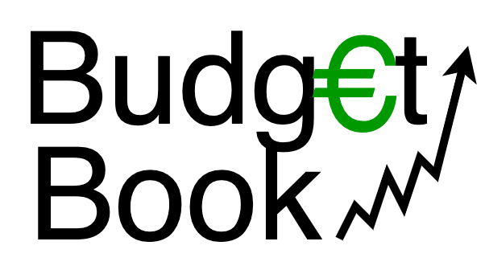

<!-- Improved compatibility of back to top link: See: https://github.com/othneildrew/Best-README-Template/pull/73 -->
<a name="readme-top"></a>

<!-- PROJECT SHIELDS -->
<!--
*** I'm using markdown "reference style" links for readability.
*** Reference links are enclosed in brackets [ ] instead of parentheses ( ).
*** See the bottom of this document for the declaration of the reference variables
*** for contributors-url, forks-url, etc. This is an optional, concise syntax you may use.
*** https://www.markdownguide.org/basic-syntax/#reference-style-links
-->
<!--
[![Contributors][contributors-shield]][contributors-url]
[![Forks][forks-shield]][forks-url]
[![Stargazers][stars-shield]][stars-url]
[![Issues][issues-shield]][issues-url]
[![MIT License][license-shield]][license-url]
[![LinkedIn][linkedin-shield]][linkedin-url]
-->


<!-- PROJECT LOGO -->
<br />
<div align="center">
  <a href="https://github.com/github_username/repo_name">
    
  </a>

<h3 align="center">JBudgetBook</h3>

  <p align="center">
    Überblicke & analysiere deine Ausgaben
    <!--
    <br />
    <a href="https://github.com/github_username/repo_name"><strong>Explore the docs »</strong></a>
    <br />
    <br />
    <a href="https://github.com/github_username/repo_name">View Demo</a>
    ·
    <a href="https://github.com/github_username/repo_name/issues">Report Bug</a>
    ·
    <a href="https://github.com/github_username/repo_name/issues">Request Feature</a>
    -->
  </p>
</div>


<!-- TABLE OF CONTENTS -->
<details>
  <summary>Table of Contents</summary>
  <ol>
    <li>
      <a href="#about-the-project">About The Project</a>
      <ul>
        <li><a href="#built-with">Built With</a></li>
      </ul>
    </li>
    <li>
      <a href="#getting-started">Getting Started</a>
      <ul>
        <!--<li><a href="#prerequisites">Prerequisites</a></li>-->
        <li><a href="#installation">Installation</a></li>
      </ul>
    </li>
    <li><a href="#usage">Usage</a></li>
    <li><a href="#roadmap">Roadmap</a></li>
    <li><a href="#contributing">Contributing</a></li>
    <li><a href="#license">License</a></li>
    <li><a href="#contact">Contact</a></li>
    <!--<li><a href="#acknowledgments">Acknowledgments</a></li>-->
  </ol>
</details>


<!-- ABOUT THE PROJECT -->
## About The Project

[![JBudgetBook-MainView][product-screenshot]](https://github.com/tpoerschke/BudgetBook)

Dieses Haushaltsbuch soll Ihnen einen Überblick über Ihre laufenden Kosten ermöglichen. Zwei Ansichten sind aktuell implementiert: Ausgabenübersicht und Jahresübersicht.  

Das Projekt befindet sich noch in einem frühen Stadium, weswegen Bugs auftreten können. Sollten Sie Bugs finden, können Sie dazu gerne Issues anlegen.

<p align="right">(<a href="#readme-top">back to top</a>)</p>


### Built With

[![OpenJDK][OpenJDK-shield]][OpenJDK-url]
[![Maven][Maven-shield]][Maven-url]
[![Hibernate][Hibernate-shield]][Hibernate-url]
[![SQLite][SQLite-shield]][SQLite-url]
[![Lombok][Lombok-shield]][Lombok-url]


<p align="right">(<a href="#readme-top">back to top</a>)</p>


<!-- GETTING STARTED -->
## Getting Started

Das Projekt kann lokal wie folgt aufgesetzt werden. Eine Installation als `.exe` (Windows) oder `.app` (Mac) ist aktuell nicht möglich.

### Installation

1. Repo klonen
   ```sh
   git clone https://github.com/tpoerschke/BudgetBook
   ```
2. Starten
   ```sh
   mvn clean javafx:run
   ```
3. Viel Spaß! :)

<p align="right">(<a href="#readme-top">back to top</a>)</p>


<!-- USAGE EXAMPLES -->
## Usage

WIP

<p align="right">(<a href="#readme-top">back to top</a>)</p>


<!-- ROADMAP -->
## Roadmap

- [x] Ausgabenübersicht
- [x] Jahresübersicht
- [ ] Einnahmen verwalten
- [ ] Analyseübersicht
- [ ] Exportfunktionalität

See the [open issues](https://github.com/github_username/repo_name/issues) for a full list of proposed features (and known issues).

<p align="right">(<a href="#readme-top">back to top</a>)</p>


<!-- CONTRIBUTING -->
## Contributing

Contributions are what make the open source community such an amazing place to learn, inspire, and create. Any contributions you make are **greatly appreciated**.

If you have a suggestion that would make this better, please fork the repo and create a pull request. You can also simply open an issue with the tag "enhancement".
Don't forget to give the project a star! Thanks again!

1. Fork the Project
2. Create your Feature Branch (`git checkout -b feature/AmazingFeature`)
3. Commit your Changes (`git commit -m 'Add some AmazingFeature'`)
4. Push to the Branch (`git push origin feature/AmazingFeature`)
5. Open a Pull Request

<p align="right">(<a href="#readme-top">back to top</a>)</p>


<!-- LICENSE -->
## License

Distributed under the GNU General Public License v3.0. See `LICENSE` for more information.

<p align="right">(<a href="#readme-top">back to top</a>)</p>


<!-- CONTACT -->
## Contact

Tim Poerschke - [@timpo@ruhr.social](https://ruhr.social/@timpo) - post@timkodiert.de

Project Link: [https://github.com/tpoerschke/BudgetBook](https://github.com/tpoerschke/BudgetBook)

<p align="right">(<a href="#readme-top">back to top</a>)</p>


<!-- ACKNOWLEDGMENTS -->
<!--
## Acknowledgments

* []()
* []()
* []()

<p align="right">(<a href="#readme-top">back to top</a>)</p>
-->


<!-- MARKDOWN LINKS & IMAGES -->
<!-- https://www.markdownguide.org/basic-syntax/#reference-style-links -->
[product-screenshot]: images/MainViewScreenshot.png

[OpenJDK-shield]: https://img.shields.io/badge/OpenJDK-222?style=for-the-badge&logo=OpenJDK
[OpenJDK-url]: https://aws.amazon.com/corretto/
[Maven-shield]: https://img.shields.io/badge/Maven-C71A36?style=for-the-badge&logo=Apache%20Maven
[Maven-url]: https://maven.apache.org/
[Hibernate-shield]: https://img.shields.io/badge/Hibernate-59666C?style=for-the-badge&logo=Hibernate
[Hibernate-url]: https://hibernate.org/
[SQLite-shield]: https://img.shields.io/badge/SQLite-003B57?style=for-the-badge&logo=SQlite
[SQLite-url]: https://www.sqlite.org/index.html
[Lombok-shield]: https://img.shields.io/badge/lombok-d9230f?style=for-the-badge
[Lombok-url]: https://projectlombok.org/
